# ChitraVichar - E-commerce Platform

A fully-featured e-commerce website built with Flutter and Flask.

<p id="top" align="center">
  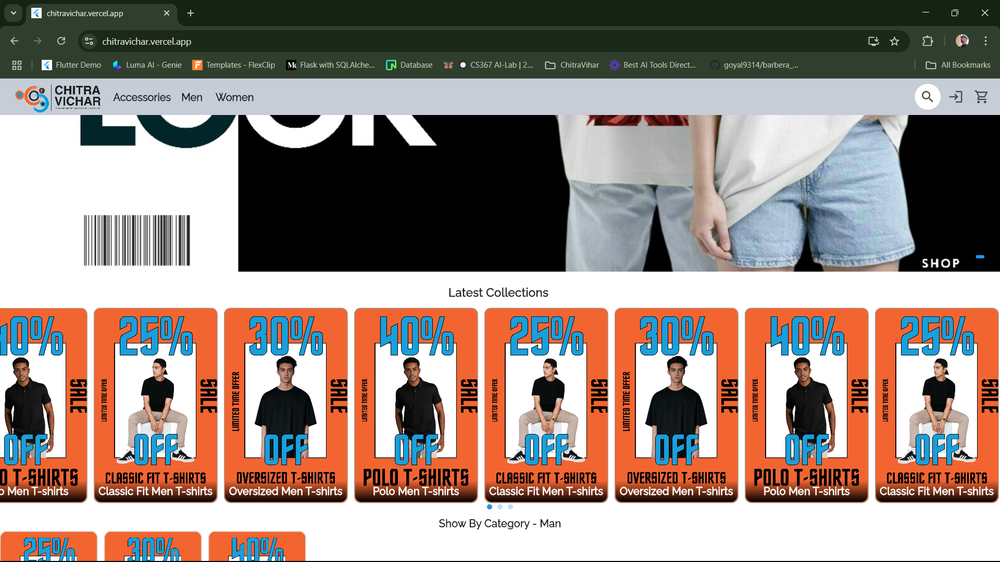
</p>

Check out the live demo here: [ChitraVichar Live](https://chitravichar.vercel.app/)

# Table of Contents
- [About ChitraVichar](#about-chitravichar)
- [Showcase](#showcase)
  * [Home Page](#Home_Page)
  * [Products List Page](#Products_List_Page)
  * [Product Details Page](#Product_Details_Page)
  * [Cart Page](#Cart_Page)
  * [Order Page](#Order_Page)
  * [Payment Confirmation Page](#Payment_Confirmation_Page)
  * [Payment successfull Page](#Payment_successfull_Page)
  * [My Profile](#My_Profile)
    * [DashBoard](#DashBoard_Page)
    * [Address Page](#Address_Page)
    * [MyOrders Page](#MyOrders_Page)
  * [Login Page](#Login_Page)
  * [Register Page](#Register_Page)
- [Features](#features)
- [Tech Stack](#tech-stack)
- [Installation](#installation)
- [Deployment](#deployment)
- [License](#license)

# About ChitraVichar
ChitraVichar is a fully API-driven e-commerce platform that enables users to browse products, manage their cart, and place orders seamlessly. The backend is built with Flask and PostgreSQL, making it a robust full-stack solution.

# Showcase

## Home_Page
<p align="center">
  
  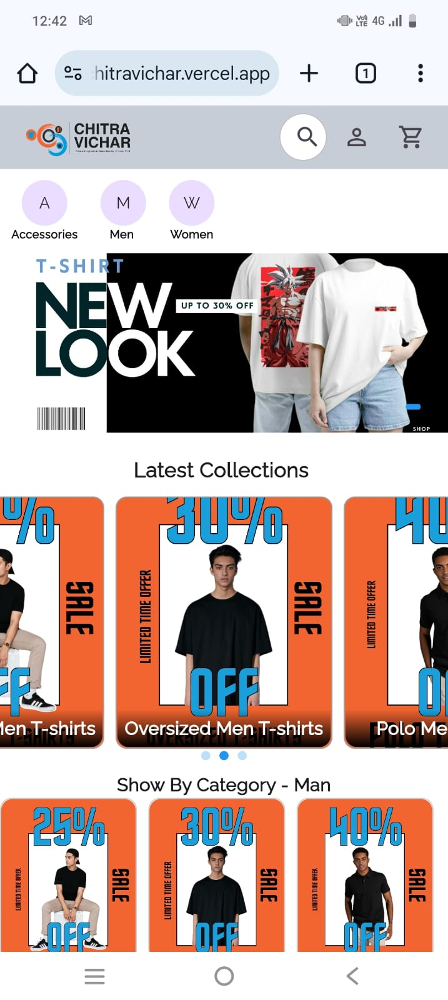
</p>

## Products_List_Page
<p align="center">
  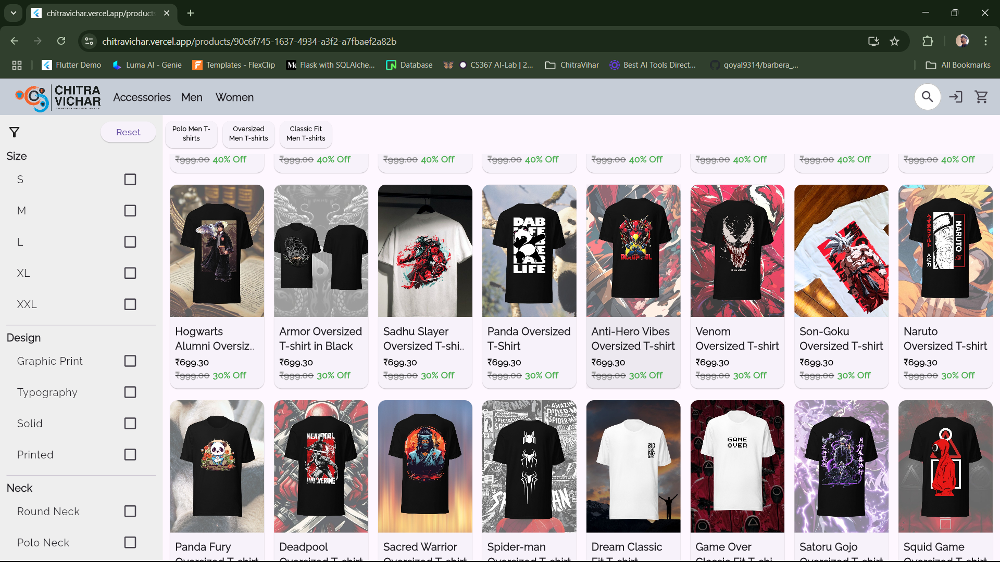
  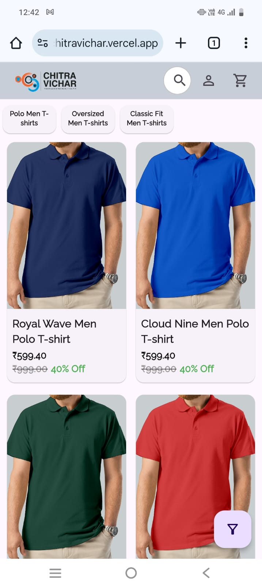
</p>

## Products_Details_Page
<p align="center">
  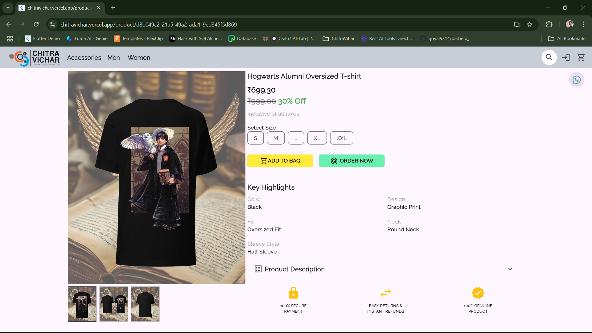
  
</p>

## Cart_Page
<p align="center">
  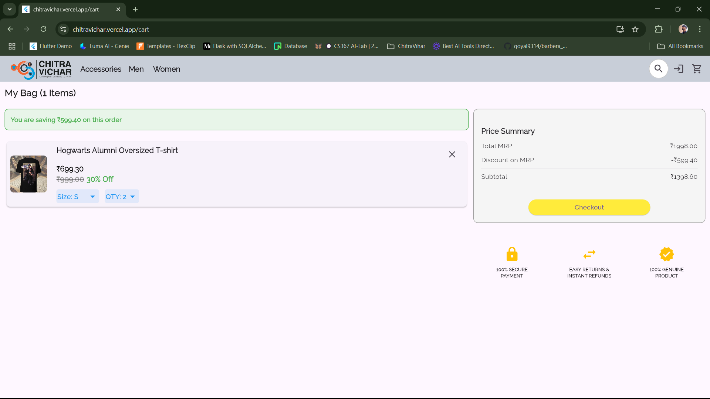
  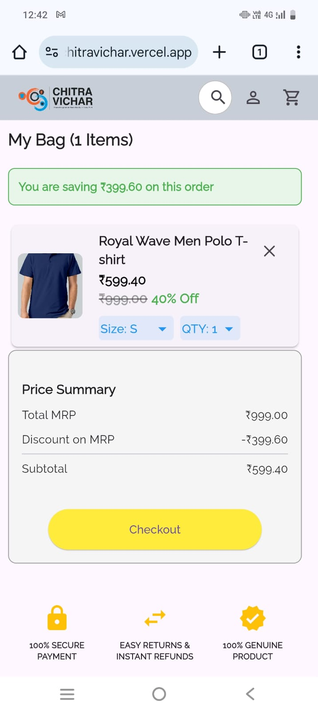
</p>

## Order_Page
<p align="center">
  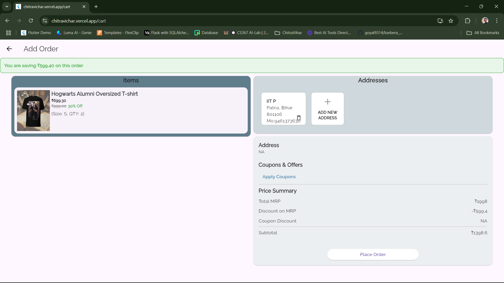
  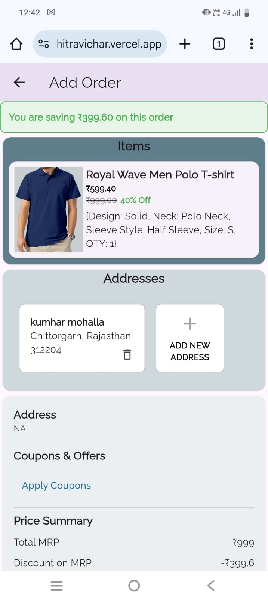
</p>

## My_Profile

### DashBoard_Page
<p align="center">
  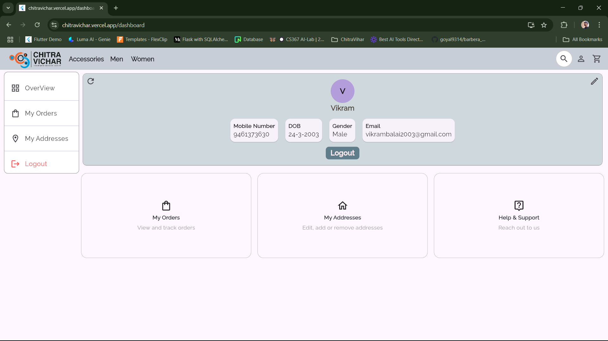
</p>

### Address_Page
<p align="center">
  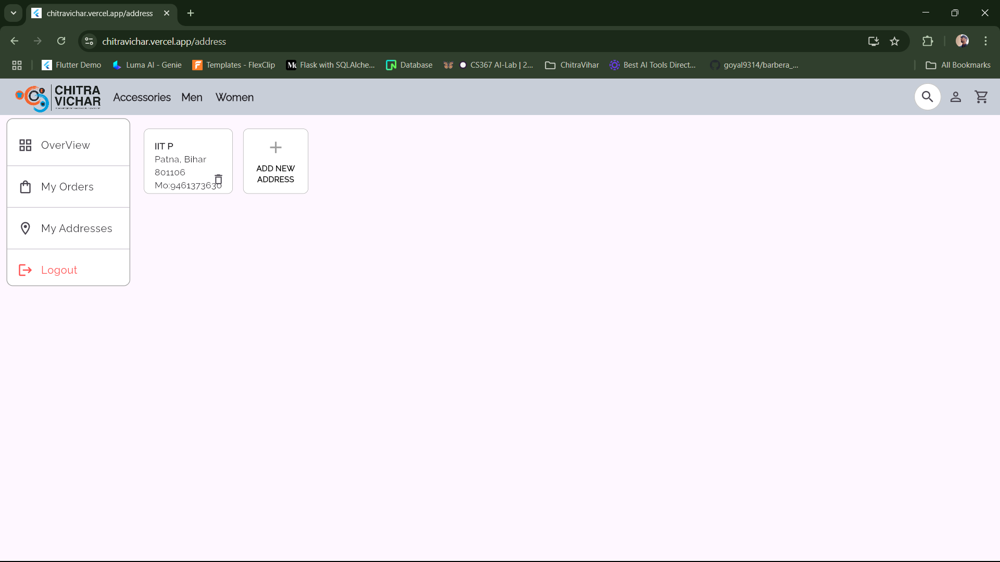
</p>

### MyOrders_Page
<p align="center">
  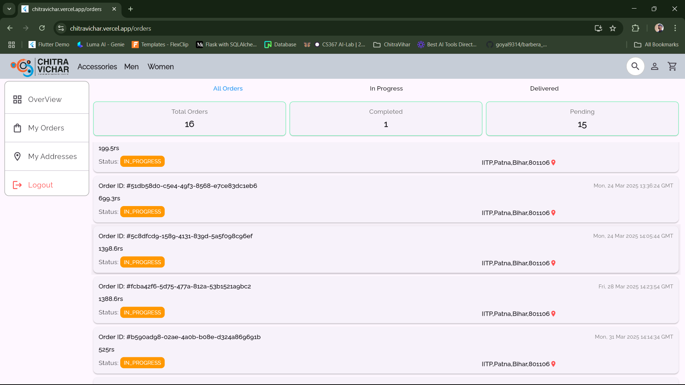
</p>

## Login_Page
<p align="center">
  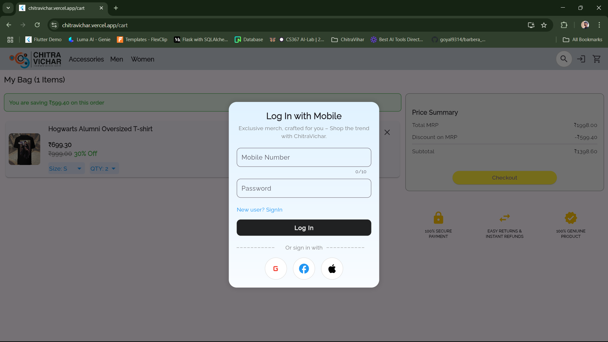
  
</p>

# Features
- Dynamic product and banner fetching from API
- User authentication & profile management
- Shopping cart and order tracking
- Razorpay payment gateway integration
- WhatsApp inquiry feature for direct communication about products
- Responsive design for both desktop and mobile

# Tech Stack
- **Frontend**: Flutter (Dart)
- **Backend**: Flask (Python) with PostgreSQL
- **Payment Gateway**: Razorpay
- **Hosting**: Vercel (Frontend), Render for Backend API

# Installation
> This project is private and not open-source at the moment.

To run the frontend locally:
1. Ensure you have Flutter installed.
2. Clone the repository (if access is granted).
3. Install dependencies:
   ```sh
   flutter pub get
   ```
4. Run the project:
   ```sh
   flutter run
   ```

# Deployment
- Deployed on **Vercel**
- Custom CSS used for Razorpay integration
- API hosted separately

# License
This project is **not open-source** currently. For any inquiries, please contact me directly.

---

For inquiries, feel free to reach out!

